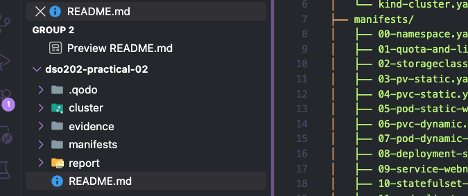
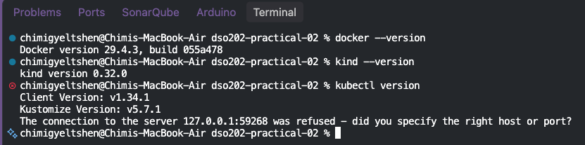
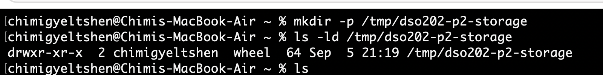
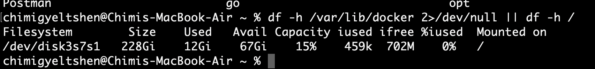
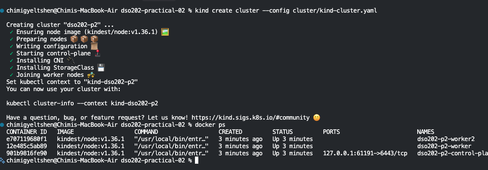
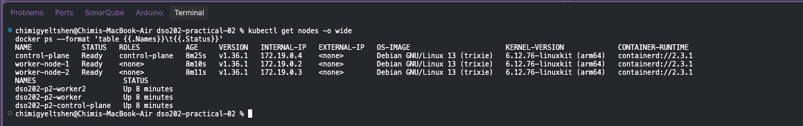
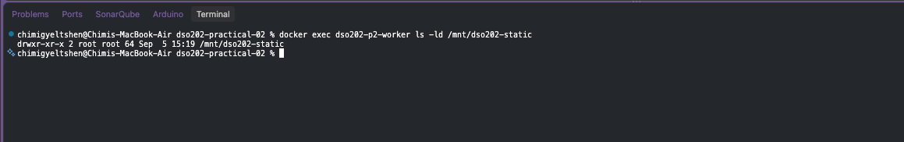
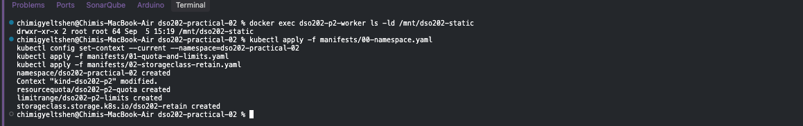

## Repository Structure
```bash
dso202-practical-02/
├── README.md                          
├── cluster/
│   └── kind-cluster.yaml              # Listing 1
├── manifests/
│   ├── 00-namespace.yaml              # Listing 2
│   ├── 01-quota-and-limits.yaml       # Listing 3
│   ├── 02-storageclass-retain.yaml    # Listing 4
│   ├── 03-pv-static.yaml              # Listing 5
│   ├── 04-pvc-static.yaml             # Listing 6
│   ├── 05-pod-static-writer.yaml      # Listing 7
│   ├── 06-pvc-dynamic.yaml            # Listing 8
│   ├── 07-pod-dynamic-writer.yaml     # Listing 9
│   ├── 08-deployment-shared-pvc.yaml  # Listing 10
│   ├── 09-service-webnote.yaml        # Listing 11
│   ├── 10-statefulset-webnote.yaml    # Listing 12
│   ├── 11-pod-client.yaml             # Listing 13
│   ├── 12-secret-postgres.yaml        # Listing 14
│   ├── 13-service-postgres.yaml       # Listing 15
│   └── 14-statefulset-postgres.yaml   # Listing 16
├── evidence/                          
└── report/
    └── practical-02-report.md        
```


## Stage 0: Prerequisites and Verification
### Required software
```bash
docker --version
kind --version
kubectl version --client
```


### Creating the host directory that Stage 2 uses for statically provisioned storage. The directory must exist before the cluster is created, because kind mounts it into a node at creation time.

```bash
mkdir -p /tmp/dso202-p2-storage
ls -ld /tmp/dso202-p2-storage
```


### checking the desk space 
```bash
df -h /var/lib/docker 2>/dev/null || df -h /
```



## Stage 1: Cluster, Namespace, and the Storage Landscape

### Create the clauster

Step 1. Copy Listing 1 into cluster/kind-cluster.yaml, then create the cluster.
```bash
kind create cluster --config cluster/kind-cluster.yaml
```


Step 2. Confirm the nodes and record the mapping between Node object names and Docker container names. Later stages inspect the node filesystem with docker exec, which needs the container name.

```bash
kubectl get nodes -o wide
docker ps --format 'table {{.Names}}\t{{.Status}}'
```


Step 3. Confirm that the host directory reached the intended node.
```bash 
docker exec dso202-p2-worker ls -ld /mnt/dso202-static
```



### Create the namespace, the quota, and the retaining StorageClass
Step 4. Apply Listings 2, 3 and 4, then make the namespace the default for the session so that later commands stay short.
```bash
kubectl apply -f manifests/00-namespace.yaml
kubectl config set-context --current --namespace=dso202-practical-02
kubectl apply -f manifests/01-quota-and-limits.yaml
kubectl apply -f manifests/02-storageclass-retain.yaml
```



