# DSO202 — Practical 02 Report
## Kubernetes Storage and Stateful Workloads

**Guide reference:** [DSO202 Practical 02 (HackMD)](https://hackmd.io/@sarojsanyasi/dso202-practical-02)

---

## 1. Objective

Practical 1 dealt with stateless workloads. This practical addresses the
opposite problem: how Kubernetes handles data that must **survive** a Pod's
lifecycle. It builds up the storage stack layer by layer — PersistentVolumes,
PersistentVolumeClaims, StorageClasses, static vs dynamic provisioning,
reclaim policies — and then shows why none of that is sufficient on its own
without a controller that understands *identity*, which is the role of the
`StatefulSet`. The practical closes with a realistic workload, PostgreSQL,
to prove the concepts hold under an actual database engine rather than a
toy writer Pod.


---

## 2. Environment Setup

### 2.1 Prerequisite Verification

Docker, `kind`, and `kubectl` versions were verified before starting:

```bash
docker --version
kind --version
kubectl version --client
```


### 2.2 Host Storage Directory

Static provisioning in Stage 2 requires a host path that exists **before**
the cluster is created, since `kind` mounts host directories into a node at
node-creation time, not afterwards:

```bash
mkdir -p /tmp/dso202-p2-storage
ls -ld /tmp/dso202-p2-storage
```


```bash
df -h /var/lib/docker 2>/dev/null || df -h /
```


---

## 3. Stage 1 — Cluster, Namespace, and the Storage Landscape

### 3.1 Cluster Creation

The cluster was created from `cluster/kind-cluster.yaml` (Listing 1):

```bash
kind create cluster --config cluster/kind-cluster.yaml
```


```bash
kubectl get nodes -o wide
docker ps --format 'table {{.Names}}\t{{.Status}}'
```


Recording the mapping between Kubernetes **Node objects** and their
underlying **Docker container names** was necessary, since later stages
inspect node-local filesystems directly via `docker exec` rather than through
the Kubernetes API.

The host directory mount was verified on the worker node:

```bash
docker exec dso202-p2-worker ls -ld /mnt/dso202-static
```


### 3.2 Namespace, Quota, and StorageClass

The namespace, resource quota, and a `Retain`-policy StorageClass were
applied and the namespace set as the default context:

```bash
kubectl apply -f manifests/00-namespace.yaml
kubectl config set-context --current --namespace=dso202-practical-02
kubectl apply -f manifests/01-quota-and-limits.yaml
kubectl apply -f manifests/02-storageclass-retain.yaml
```


```bash
kubectl describe resourcequota dso202-p2-quota
```

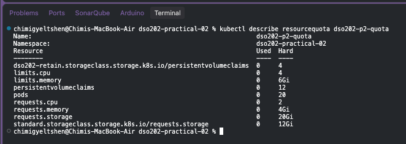

Unlike Practical 1's quota (CPU, memory, object counts), this quota adds
**three storage-specific constraints**: a cap on the number of PVCs, a cap on
total requested storage, and a per-StorageClass cap — all of which matter
directly for the provisioning experiments that follow.

### 3.3 Locating the Provisioner

```bash
kubectl get storageclass
```

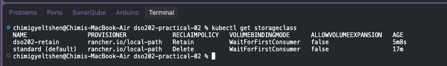

```bash
kubectl -n local-path-storage get pods
```

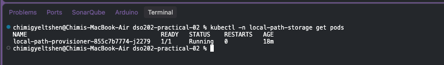

```bash
kubectl -n local-path-storage get configmap local-path-config -o jsonpath='{.data.config\.json}'
```

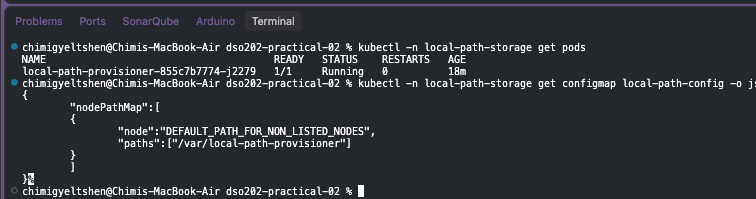

The default dynamic provisioner in this cluster is **local-path-provisioner**,
running in its own `local-path-storage` namespace rather than in the
practical's namespace. Its `ConfigMap` is the authoritative source for where
it writes data on disk — not any external documentation. After applying the
custom `manual` StorageClass, both classes appear side-by-side in
`kubectl get storageclass`.

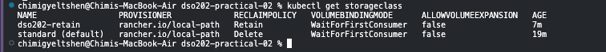

---

## 4. Stage 2 — Static Provisioning and the Meaning of `Retain`

### 4.1 Creating and Inspecting the PV

```bash
kubectl apply -f manifests/03-pv-static.yaml
kubectl get pv
```

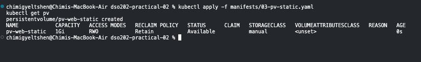

```bash
kubectl get pv pv-web-static -o jsonpath='{.spec.hostPath.path}{"\n"}'
kubectl get pv pv-web-static -o jsonpath='{.spec.nodeAffinity}{"\n"}'
```

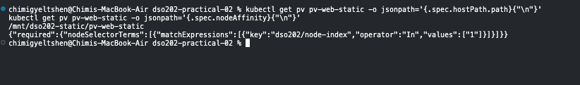

The two fields inspected here — `hostPath.path` and `nodeAffinity` — are what
constrain scheduling: a statically provisioned, host-path-backed volume ties
any Pod using it to a specific node.

### 4.2 Claiming and Writing

```bash
kubectl apply -f manifests/04-pvc-static.yaml
kubectl get pvc
```

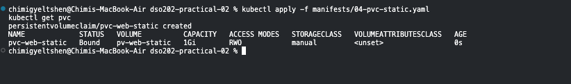

```bash
kubectl get storageclass manual
```

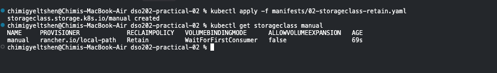

```bash
kubectl apply -f manifests/05-pod-static-writer.yaml
kubectl wait --for=condition=Ready pod/static-writer --timeout=90s
kubectl get pod static-writer -o wide
```

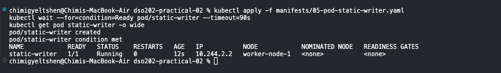

```bash
kubectl exec static-writer -- cat /data/ledger.txt
cat /tmp/dso202-p2-storage/pv-web-static/ledger.txt
```

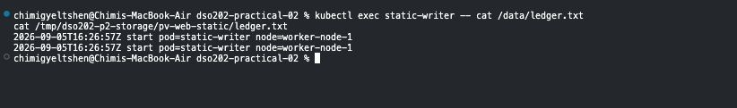

Because both the PV and PVC specify `storageClassName: manual`, the claim
binds directly to the pre-created `pv-web-static` volume instead of
triggering a provisioner — this is the defining behaviour of static
provisioning.

### 4.3 Volume Outlives the Pod

```bash
kubectl delete pod static-writer
kubectl apply -f manifests/05-pod-static-writer.yaml
kubectl wait --for=condition=Ready pod/static-writer --timeout=90s
kubectl exec static-writer -- cat /data/ledger.txt
```

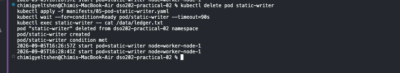

The ledger file accumulates an additional line on each Pod restart,
confirming the volume's data persists independently of the Pod's lifecycle.

### 4.4 Deleting the Claim: `Released`, Not `Available`

```bash
kubectl delete pod static-writer
kubectl delete pvc pvc-web-static
kubectl get pv
```

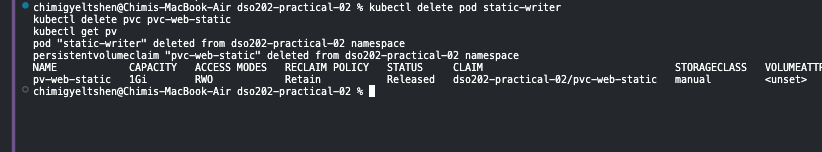

With a `Retain` reclaim policy, deleting the PVC does **not** free the PV for
reuse — it transitions to the `Released` phase and must be manually
reclaimed. Confirming the underlying data was untouched, then removing the
PV object itself:

```bash
cat /tmp/dso202-p2-storage/pv-web-static/ledger.txt
kubectl delete pv pv-web-static
ls -l /tmp/dso202-p2-storage/pv-web-static/
```

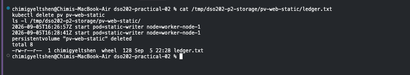

Even after the PV object is deleted, the host directory and its contents
remain — deleting the Kubernetes object never deletes host-path data under
`Retain`. All three objects were then recreated to confirm the ledger
persisted across the full teardown/rebuild cycle.

```bash
kubectl apply -f manifests/03-pv-static.yaml
kubectl apply -f manifests/04-pvc-static.yaml
kubectl apply -f manifests/05-pod-static-writer.yaml
kubectl wait --for=condition=Ready pod/static-writer --timeout=90s
kubectl exec static-writer -- cat /data/ledger.txt
```

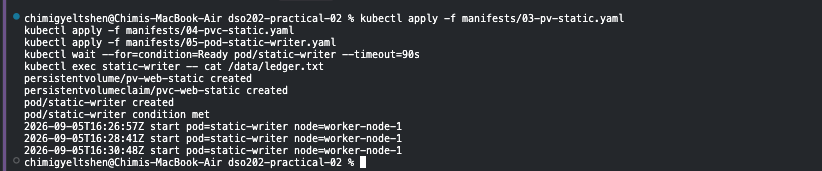

---

## 5. Stage 3 — Dynamic Provisioning: Two Uncomfortable Truths

### 5.1 A Claim That Will Not Bind

```bash
kubectl apply -f manifests/06-pvc-dynamic.yaml
kubectl get pvc dynamic-data
```

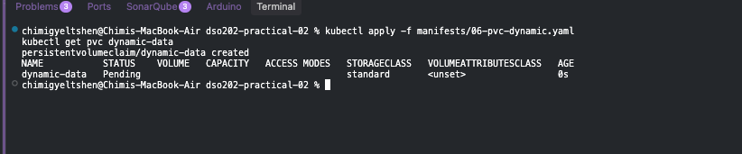

```bash
kubectl describe pvc dynamic-data | tail -n 6
```

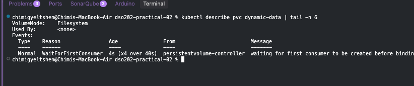

With `local-path-provisioner`, a PVC alone does **not** trigger volume
creation — this class uses `WaitForFirstConsumer` binding, so the claim stays
`Pending` until a Pod actually mounts it. The Events section of `describe`
is the authoritative explanation, not assumption.

### 5.2 Introducing a Consumer

```bash
kubectl apply -f manifests/07-pod-dynamic-writer.yaml
kubectl wait --for=condition=Ready pod/dynamic-writer --timeout=120s
kubectl get pvc dynamic-data
kubectl get pv
```

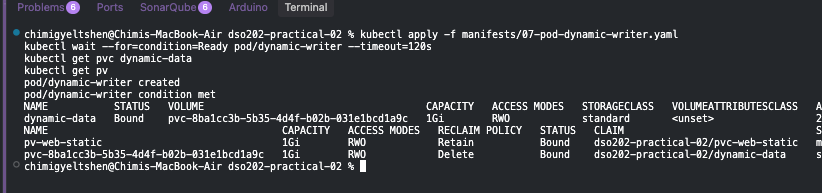

```bash
kubectl get pod dynamic-writer -o wide
docker exec dso202-p2-worker2 ls /var/local-path-provisioner
```

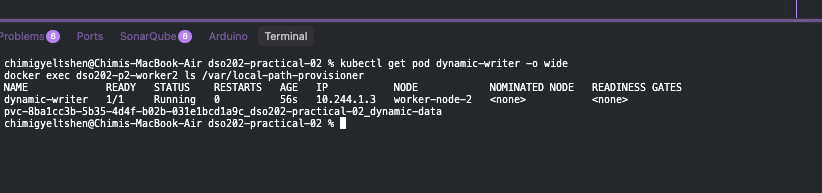

Once a Pod references the claim, the provisioner creates the volume on
whichever node the Pod is scheduled to — the node lookup from Stage 1
translates the Pod's node name into the correct `docker exec` target.

### 5.3 Truth #1 — Requested Size Is Not Enforced

```bash
kubectl exec dynamic-writer -- df -h /data
```

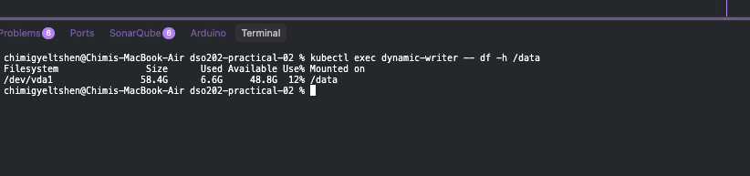

Despite requesting `1Gi`, the mounted filesystem reports the full size of
the underlying host disk. `local-path-provisioner` does not enforce
capacity limits the way a true block-storage backend would.

### 5.4 Truth #2 — The Volume Cannot Grow

```bash
kubectl patch pvc dynamic-data --type merge -p '{"spec":{"resources":{"requests":{"storage":"2Gi"}}}}'
```

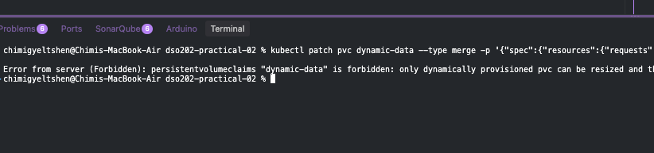

This patch is rejected by the API server itself (not the provisioner),
because the StorageClass sets `allowVolumeExpansion: false`. The rejection
being loud and immediate is the useful outcome here: **StorageClass choice
is effectively a decision about a workload's future**, made before any data
exists — a claim on an expandable class is grown simply by editing the same
`resources.requests.storage` field, after which both the volume and its
filesystem are resized.

### 5.5 Comparing Reclaim Behaviour, Then Deleting

```bash
kubectl exec dynamic-writer -- cat /data/ledger.txt
kubectl delete pod dynamic-writer
kubectl delete pvc dynamic-data
kubectl get pv
docker exec dso202-p2-worker2 ls /var/local-path-provisioner
```

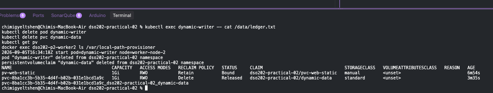

Unlike the `manual`/`Retain` class in Stage 2, the dynamic class's default
`Delete` reclaim policy removes both the PV object and the underlying host
data as soon as the claim is deleted.

---

## 6. Stage 4 — Why a Deployment Cannot Own State

```bash
kubectl apply -f manifests/08-deployment-shared-pvc.yaml
kubectl rollout status deployment/shared-writer --timeout=180s
kubectl get pods -l app=shared-writer -o custom-columns=NAME:.metadata.name,NODE:.spec.nodeName
```

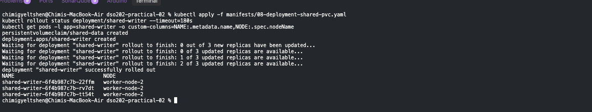

```bash
kubectl exec deploy/shared-writer -- cat /data/visitors.log
```

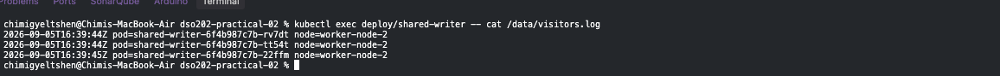

Three replicas of a `Deployment` all mounting the **same** PVC can write to
a shared log file — but that only works because the underlying access mode
and the test cluster happen to permit it.

```bash
kubectl delete pod -l app=shared-writer --field-selector status.phase=Running --wait=false
sleep 15
kubectl get pods -l app=shared-writer -o custom-columns=NAME:.metadata.name
```

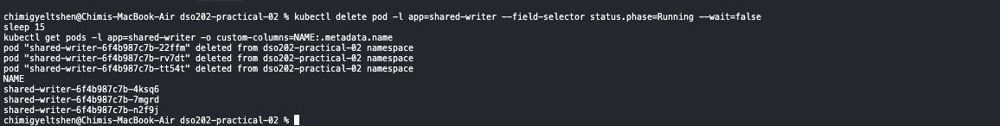

Deleting a replica reveals the **identity problem**: `Deployment` Pods get
new, randomly suffixed names on replacement, with no durable relationship
between a replica and "its" data. This is masked in the toy example, but is
exactly the failure mode that makes `Deployment` unsuitable for real
multi-replica stateful workloads such as databases, where each replica must
own distinct, addressable storage.

```bash
kubectl delete -f manifests/08-deployment-shared-pvc.yaml
kubectl get pvc
```

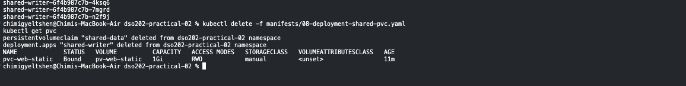

---

## 7. Stage 5 — StatefulSets and Stable Identity

### 7.1 The Headless Service First

```bash
kubectl apply -f manifests/09-service-webnote.yaml
kubectl get service webnote
```

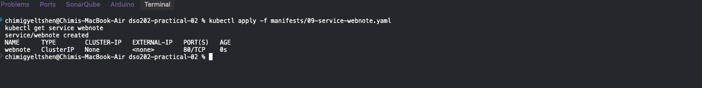

The headless Service (`clusterIP: None`) is what enables per-Pod DNS
records. Applying it **before** the StatefulSet avoids a window where Pods
exist but are not yet individually addressable.

### 7.2 Ordered Pod Creation

```bash
kubectl apply -f manifests/10-statefulset-webnote.yaml
kubectl get pods -l app=webnote -w
```

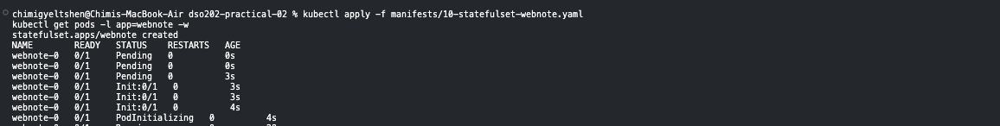

```bash
kubectl get pvc -l app=webnote
```

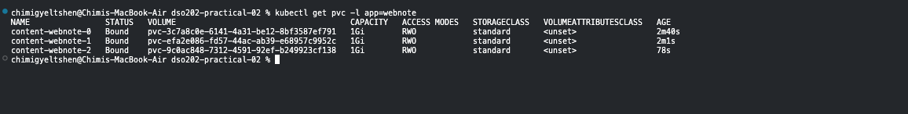

```bash
kubectl get pods -l app=webnote -o custom-columns=NAME:.metadata.name,NODE:.spec.nodeName,IP:.status.podIP
```

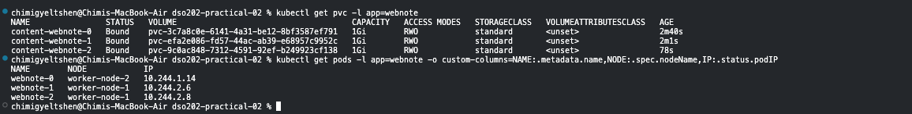

Pods are created in strict order (`webnote-0`, `webnote-1`, `webnote-2`),
each with its own automatically provisioned PVC. Because storage is now
per-Pod rather than shared, scheduling is no longer constrained the way the
static Stage 2 volume was.

### 7.3 Addressing Individual Pods

```bash
kubectl apply -f manifests/11-pod-client.yaml
kubectl wait --for=condition=Ready pod/client --timeout=90s
kubectl exec client -- nslookup webnote.dso202-practical-02.svc.cluster.local
```

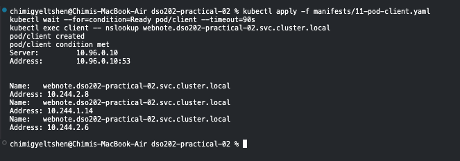

```bash
kubectl exec client -- wget -qO- http://webnote-1.webnote.dso202-practical-02.svc.cluster.local
```

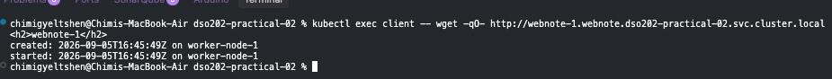

```bash
kubectl get endpointslice -l kubernetes.io/service-name=webnote
```

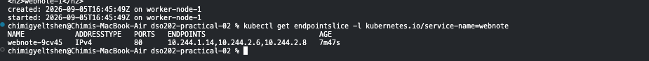

Each Pod resolves under a stable, predictable DNS name
(`<pod-name>.<service>.<namespace>.svc.cluster.local`) — the reverse of a
normal Service, which load-balances across replicas rather than exposing
them individually.

### 7.4 Private, Per-Pod Volumes

```bash
kubectl exec webnote-0 -- sh -c 'echo "note added by hand in Stage 5" >> /usr/share/nginx/html/index.html'
kubectl exec client -- wget -qO- http://webnote-0.webnote.dso202-practical-02.svc.cluster.local
kubectl exec client -- wget -qO- http://webnote-1.webnote.dso202-practical-02.svc.cluster.local
```

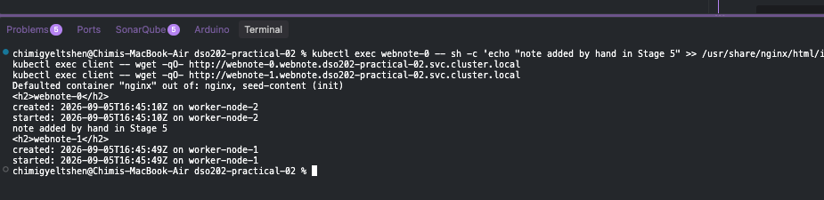

The edit made to `webnote-0` is visible only through `webnote-0` — proving
each replica's storage is isolated, unlike the shared-PVC `Deployment` in
Stage 4.

### 7.5 Identity and Storage Survive Deletion

```bash
kubectl delete pod webnote-1
kubectl wait --for=condition=Ready pod/webnote-1 --timeout=120s
kubectl get pod webnote-1 -o custom-columns=NAME:.metadata.name,NODE:.spec.nodeName,IP:.status.podIP
kubectl get pvc content-webnote-1
kubectl exec client -- wget -qO- http://webnote-1.webnote.dso202-practical-02.svc.cluster.local
```

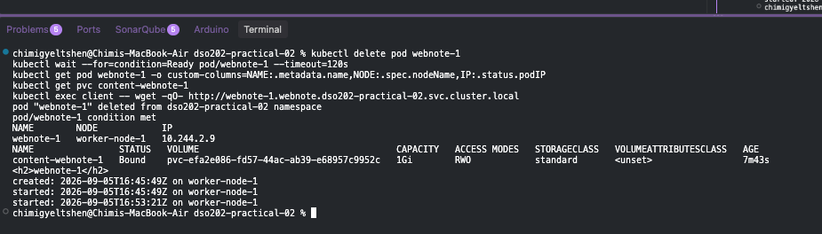

The replacement Pod keeps the exact same name and reattaches the same PVC —
this is the core guarantee a `StatefulSet` provides that a `Deployment`
cannot.

---

## 8. Stage 6 — Scaling, Retention, and Ordered Updates

### 8.1 Scale Up

```bash
kubectl scale statefulset webnote --replicas=4
kubectl wait --for=condition=Ready pod/webnote-3 --timeout=120s
kubectl get pvc -l app=webnote --no-headers | wc -l
```

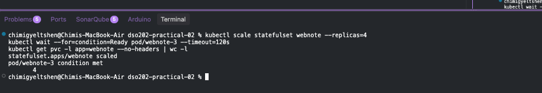

A new PVC is created automatically alongside the new ordinal Pod.

### 8.2 Scale Down — Claims Are Kept

```bash
kubectl scale statefulset webnote --replicas=2
kubectl get pods -l app=webnote -w
```

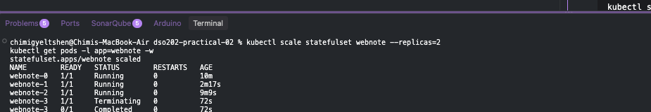

```bash
kubectl get pvc -l app=webnote
```

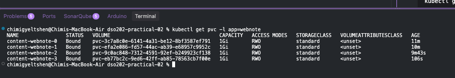

Termination happens in strict reverse order (highest ordinal first). Scaling
down does **not** delete the PVCs belonging to removed replicas — this is a
deliberate safety default, so that scaling back up restores the same data:

```bash
kubectl scale statefulset webnote --replicas=3
kubectl wait --for=condition=Ready pod/webnote-2 --timeout=120s
kubectl exec client -- wget -qO- http://webnote-2.webnote.dso202-practical-02.svc.cluster.local
```

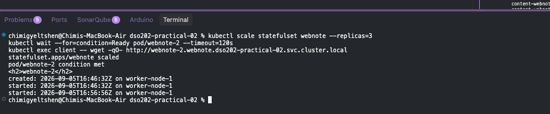

### 8.3 Partitioned Rolling Update

The manifest was edited to set `spec.updateStrategy.rollingUpdate.partition`
to `2` and the image tag changed from `nginx:1.30-alpine` to
`nginx:1.31-alpine`:

```bash
kubectl apply -f manifests/10-statefulset-webnote.yaml
sleep 30
kubectl get pods -l app=webnote -o custom-columns=NAME:.metadata.name,IMAGE:.spec.containers[0].image
```

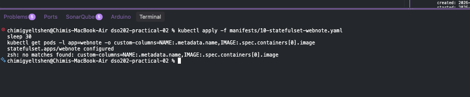

With `partition: 2`, only Pods with an ordinal **greater than or equal to**
the partition value are updated — meaning only `webnote-2` picks up the new
image, while `webnote-0` and `webnote-1` remain on the old version. This is
how a canary-style, ordinal-controlled rollout is achieved with
StatefulSets.

Completing the rollout:

```bash
kubectl apply -f manifests/10-statefulset-webnote.yaml   # partition reset to 0
kubectl rollout status statefulset/webnote --timeout=300s
kubectl get pods -l app=webnote -o custom-columns=NAME:.metadata.name,IMAGE:.spec.containers[0].image
```

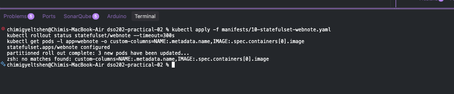

### 8.4 Deleting the Controller, Keeping the Data

```bash
kubectl delete statefulset webnote
kubectl get pods -l app=webnote
kubectl get pvc -l app=webnote --no-headers | wc -l
```

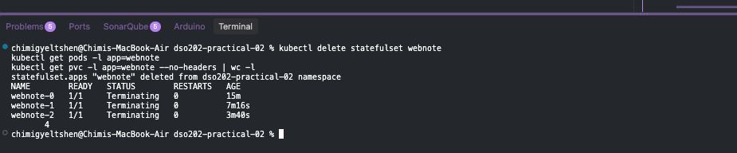

Deleting the `StatefulSet` object removes the Pods but leaves the PVCs
intact. Recreating it reattaches the existing volumes with no data loss:

```bash
kubectl apply -f manifests/10-statefulset-webnote.yaml
kubectl rollout status statefulset/webnote --timeout=300s
kubectl exec client -- wget -qO- http://webnote-1.webnote.dso202-practical-02.svc.cluster.local
```

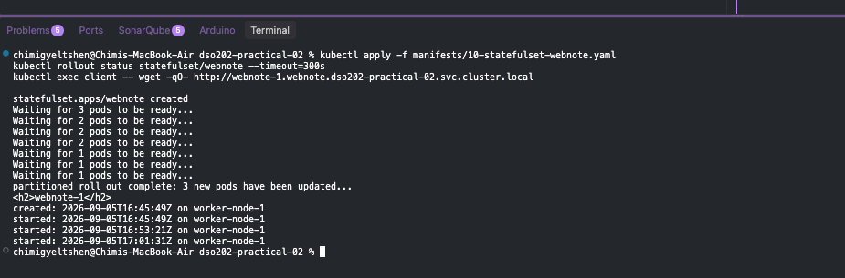

---

## 9. Stage 7 — A Real Stateful Application: PostgreSQL

### 9.1 Credentials and Services

```bash
kubectl apply -f manifests/12-secret-postgres.yaml
kubectl get secret postgres-credentials
kubectl get secret postgres-credentials -o jsonpath='{.data.POSTGRES_USER}' | base64 -d
```

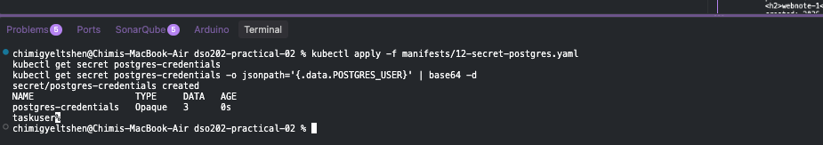

A `Secret` base64-encodes values for storage and transit convenience — it is
**not** encryption at rest by default, which is worth noting explicitly.

```bash
kubectl apply -f manifests/13-service-postgres.yaml
kubectl get services
```

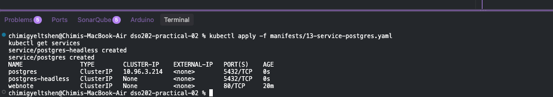

Two Services are defined together: a normal ClusterIP Service for
application connections, and a headless Service for direct per-Pod
addressing — mirroring the pattern established in Stage 5.

### 9.2 Deploying the Database

```bash
kubectl apply -f manifests/14-statefulset-postgres.yaml
kubectl get pods -l app=postgres -w
```

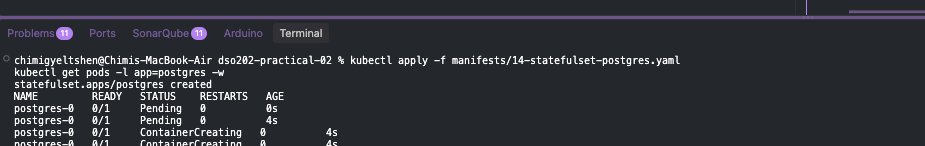

```bash
kubectl logs postgres-0 | tail -n 4
kubectl get pvc data-postgres-0
kubectl get pv
```

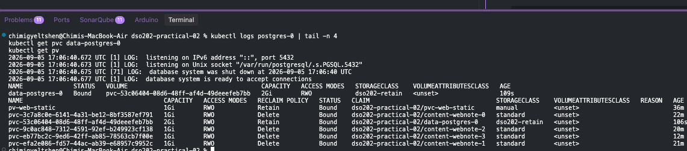

```bash
kubectl exec postgres-0 -- sh -c 'echo "$PGDATA"; ls /var/lib/postgresql'
```

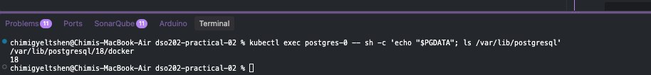

The first startup takes noticeably longer than subsequent ones, since
PostgreSQL must initialise its data directory (`$PGDATA`) on a fresh volume.

### 9.3 Writing Data and Testing Durability

```bash
kubectl exec postgres-0 -- psql -U taskuser -d tasktracker -c \
  "CREATE TABLE tasks (id serial PRIMARY KEY, title text NOT NULL, done boolean NOT NULL DEFAULT false, created_at timestamptz NOT NULL DEFAULT now());"

kubectl exec postgres-0 -- psql -U taskuser -d tasktracker -c \
  "INSERT INTO tasks (title) VALUES ('Complete Practical 2'), ('Read Unit II notes'), ('Draft the report');"

kubectl exec postgres-0 -- psql -U taskuser -d tasktracker -c \
  "SELECT id, title, done FROM tasks ORDER BY id;"
```

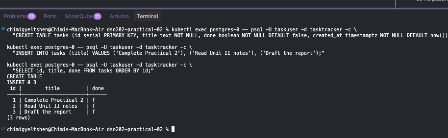

Connections here use the container's local Unix socket, which the official
PostgreSQL image trusts without a password inside the Pod.

**The core test of the practical:**

```bash
kubectl delete pod postgres-0
kubectl wait --for=condition=Ready pod/postgres-0 --timeout=180s
kubectl exec postgres-0 -- psql -U taskuser -d tasktracker -c "SELECT count(*) FROM tasks;"
```

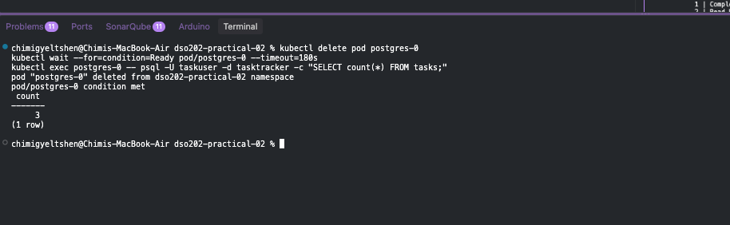

All three inserted rows survive Pod deletion and recreation, confirming the
StatefulSet + PVC combination correctly preserves database state
independent of the Pod's lifecycle.

```bash
kubectl logs postgres-0 | head -n 8
```


The recovery log lines show PostgreSQL recognising the existing data
directory on the reattached volume rather than reinitialising it.

```bash
kubectl get pvc data-postgres-0
kubectl exec client -- nslookup postgres.dso202-practical-02.svc.cluster.local
kubectl exec client -- nslookup postgres-0.postgres-headless.dso202-practical-02.svc.cluster.local
```


The claim `data-postgres-0` was reused (not recreated), and both DNS forms
resolve correctly — the load-balancing Service name for application use, and
the direct Pod name for operational access.

---

## 10. Stage 8 — Cleanup and the Cost of Retain

### 10.1 Evidence Capture

Before any deletion, the full cluster state was captured for the record:

```bash
mkdir -p evidence
kubectl get all -o wide > evidence/final-state-all.txt
kubectl get pv,pvc,storageclass -o wide > evidence/final-state-storage.txt
kubectl get statefulset webnote -o yaml > evidence/final-statefulset-webnote.yaml
kubectl get events --sort-by=.lastTimestamp > evidence/final-state-events.txt
kubectl exec postgres-0 -- pg_dump -U taskuser -d tasktracker > evidence/tasktracker-dump.sql
```


### 10.2 Deleting Workloads

```bash
kubectl delete -f manifests/14-statefulset-postgres.yaml
kubectl delete -f manifests/10-statefulset-webnote.yaml
kubectl delete -f manifests/11-pod-client.yaml
kubectl delete -f manifests/05-pod-static-writer.yaml
kubectl get pods
```


### 10.3 PVCs Are Not Removed Automatically

```bash
kubectl get pvc
```


Deleting workloads (StatefulSets, Deployments, Pods) never deletes the PVCs
they used — this is a deliberate safeguard against accidental data loss and
must be done as an explicit, separate step:

```bash
kubectl delete pvc --all
kubectl get pv
```


At this point, the two reclaim policies diverge visibly: PVs backed by
`Delete`-policy claims disappear entirely, while PVs backed by
`Retain`-policy claims (the `manual` class) move to `Released` and must be
cleaned up by hand.

### 10.4 Manual Reclamation

```bash
kubectl delete pv pv-web-static
kubectl get pv
docker exec dso202-p2-worker ls /var/local-path-provisioner
```


Removing the PV **API object** still does not remove the underlying host
data — that is a separate, manual filesystem operation.

### 10.5 Cluster Teardown

```bash
kubectl config set-context --current --namespace=default
kind delete cluster --name dso202-p2
kind get clusters
docker ps
```


### 10.6 The Final Asymmetry

```bash
ls -l /tmp/dso202-p2-storage/pv-web-static/
```


Even after the entire `kind` cluster is deleted, the `ledger.txt` file
created under the `Retain`-policy static PV remains on the host filesystem.
This is the practical's closing demonstration: **`Retain` means exactly what
it says, all the way down to the host** — cluster deletion is not, by
itself, a substitute for deliberate storage cleanup.

---

## 11. Key Takeaways

1. **PV/PVC/StorageClass** together decouple storage requests from storage
   implementation, but the binding mode (`Immediate` vs `WaitForFirstConsumer`)
   and reclaim policy (`Retain` vs `Delete`) must be chosen deliberately —
   they materially change operational behaviour.
2. **Static provisioning** ties a Pod to a specific node via `nodeAffinity`;
   **dynamic provisioning** is more flexible but, with `local-path-provisioner`,
   does not enforce requested capacity and cannot expand a class marked
   `allowVolumeExpansion: false`.
3. A **`Deployment`** is the wrong tool for workloads that need durable,
   per-replica identity — the shared-PVC experiment in Stage 4 exposes the
   identity problem that StatefulSets exist to solve.
4. A **`StatefulSet`**, paired with a headless Service, provides stable
   ordinals, stable per-Pod DNS names, and stable per-Pod storage that
   survives Pod deletion, scaling, and even deletion of the StatefulSet
   controller itself.
5. **Partitioned rolling updates** give ordinal-level control over which
   replicas receive an update, enabling canary-style rollouts of stateful
   workloads.
6. Running **PostgreSQL** as a StatefulSet demonstrates these guarantees
   under a real database engine: inserted data survives Pod deletion and the
   claim is reused rather than recreated on restart.
7. **Cleanup requires explicit action at every layer** — deleting workloads
   does not delete claims, deleting claims under `Retain` does not delete
   volumes, deleting volumes does not delete host data, and deleting the
   entire cluster does not delete host data either.

---

## 12. Evidence

Screenshots corresponding to each numbered step (1–68) are stored in the
`evidence/` directory, as referenced throughout the original walkthrough.
Final-state exports (`final-state-all.txt`, `final-state-storage.txt`,
`final-statefulset-webnote.yaml`, `final-state-events.txt`,
`tasktracker-dump.sql`) were captured in Stage 8 prior to teardown and are
also retained in `evidence/`.